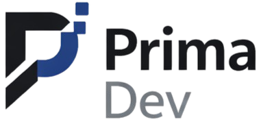

<div align="center">
  
  <h1>Prima Wisnu Abror Azmi - Portfolio</h1>
  <p><strong>Professional Portfolio & Digital Identity</strong></p>
  <p>A modern, interactive, and bilingual personal portfolio showcasing my expertise in Technology & Business Problem Solving, AI Architecture, and Digital Transformation.</p>
  <br />
</div>

## Overview

This portfolio is built with a focus on modern web design, speed, and premium user experience. It serves as my digital business card, highlighting my role as a Technology & Business Problem Solver at **PT Primadev Digital Technology**.

The design emphasizes a sleek glassmorphism aesthetic, dynamic animations, seamless localization, and an elegant dark mode implementation to ensure maximum readability and visual appeal.

## Features

- **Bilingual Support**: Full internationalization (i18n) supporting both English (EN) and Indonesian (ID) with smooth state management.
- **Dark & Light Mode**: A meticulously crafted dark mode that automatically shifts color palettes and contrast levels while maintaining brand identity.
- **Modern Aesthetics**: Utilizes glassmorphism, soft shadows, vibrant gradient accents, and precise typography (Inter).
- **Responsive Layout**: Designed mobile-first, ensuring an optimal, non-scroll-locked reading experience across all devices.
- **Performance Optimized**: Built using the lightning-fast Vite build tool and minimal dependencies.

## Tech Stack

- **Framework**: [React.js](https://reactjs.org/) (v18)
- **Build Tool**: [Vite](https://vitejs.dev/)
- **Styling**: [Tailwind CSS](https://tailwindcss.com/) (v3) + Custom CSS Variables
- **Icons**: [Google Material Symbols](https://fonts.google.com/icons)

## Getting Started

To run this project locally, follow these steps:

### Prerequisites

Make sure you have [Node.js](https://nodejs.org/) installed on your machine.

### Installation

1. **Clone the repository**

   ```bash
   git clone https://github.com/yourusername/wisnu-porto.git
   cd wisnu-porto
   ```
2. **Install dependencies**

   ```bash
   npm install
   ```
3. **Start the development server**

   ```bash
   npm run dev
   ```

   Open `http://localhost:5173` in your browser to view the project.

## Building for Production

To create a production-ready build:

```bash
npm run build
```

This will generate optimized static files in the `dist` folder.

## Deployment

This project is configured for seamless deployment on **Netlify**. A `netlify.toml` file is included in the root directory to automatically handle build commands and static routing.

### Deploying to Netlify

1. Connect this repository to your Netlify account.
2. Netlify will automatically detect the Vite build settings.
3. Click **Deploy**!

---

<div align="center">
  <p>© 2026 Prima Wisnu Abror Azmi. All Rights Reserved.</p>
  <p><strong>PT Primadev Digital Technology</strong></p>
</div>
